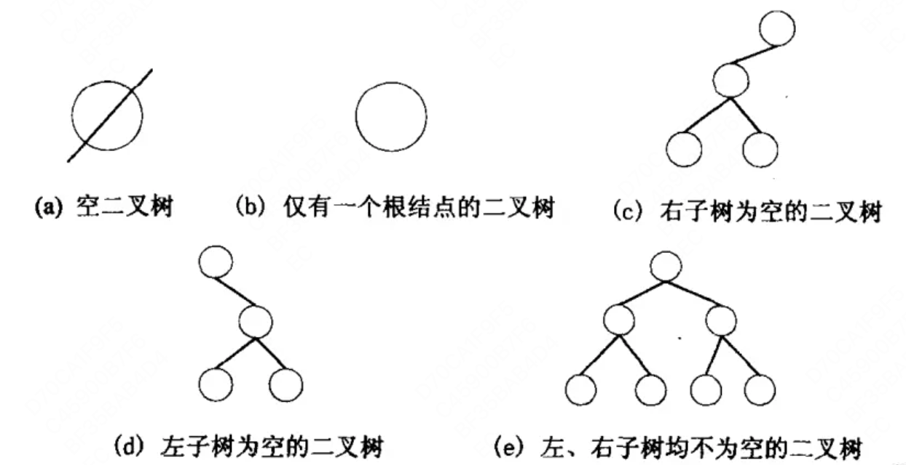
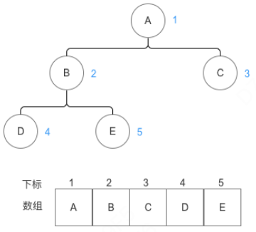
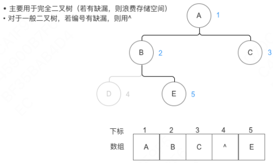
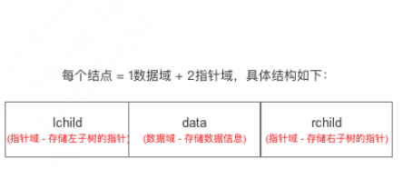
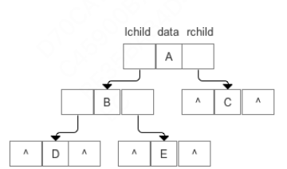
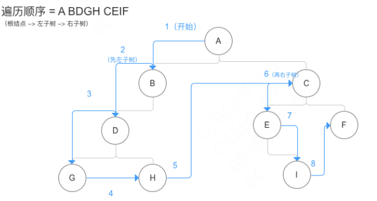
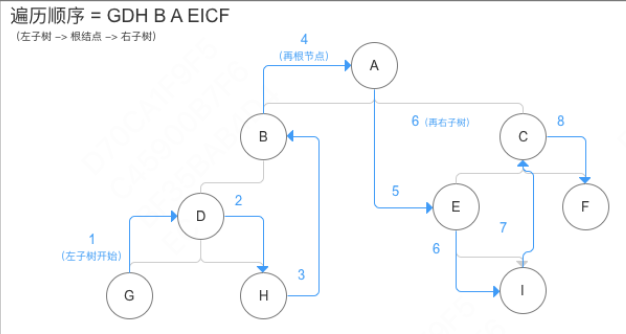
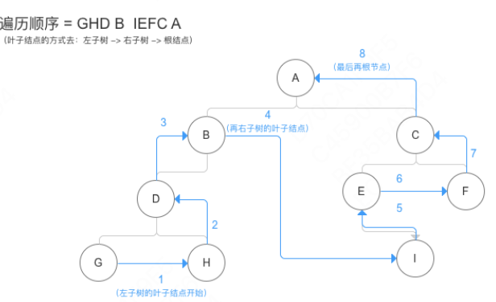
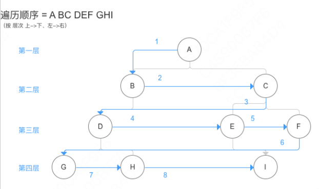

树结构是一种非线形的数据结构。在客观世界中也很常见，如公司的组织架构。在计算机领域里也很常见，是重要的组织形式之一。

## 定义

### 1. 树的定义

**树是n(n>=0)个结点的有限集**，可以是空树也可以是非空树，对于非空树：

- 每一个非根节点有且仅有一个根节点

- 除根节点之外，每个子节点可以分为多个不相交的子树

### 2. 树的相关术语

- 结点：是数据结构中的基础，是构成复杂数据结构的基本组成单位

- 结点的度：结点拥有的子树数目称为结点的度

- 结点关系：结点子树的根结点为该结点的**孩子结点**。相应该结点称为孩子结点的**双亲结点**。同一个双亲结点的孩子结点称为**兄弟结点**

- 结点层次：从根开始定义起，根为第一层，根的孩子为第二层...以此类推

- 树的深度：树中结点的最大层次数称为树的深度或高度

### 3. 二叉树的定义

**二叉树(Binary Tree)是n(n>0)个结点所构成的集合**，它可以是空树也可以是非空树，对于非空树：

- 有且只有一个根结点

- 除了根结点以外其余结点分为两个互不相交的子集，分别为左子树和右子树，且这两个本身又都是二叉树

二叉树和树一样具有递归性质，但它俩的区别在于：

- 二叉树每个结点至多只有两棵子树（即二叉树中不存在度大于2的结点）

- 二叉树的子树有左右之分，其次序不能任意颠倒



### 4. 二叉树的性质

- 二叉树第i层(i>=1)层上的结点数最多为2^i-1

- 高度为k的二叉树最多有2^k-1个结点

- 终端结点(叶结点) = a 个，结点数(度 = 2) = b 个，那么a = b + 1

- 对于完全二叉树(结点数 = n)，树的深度 = log2N + 1

### 5. 二叉树的存储结构

二叉树的存储结构包括**顺序存储结构**和**链式存储结构**

| 结构 | 结构特点 | 示意图 | 备注 |
| --- | --- | --- | --- |
| 顺序存储结构 |  用一维数组存储二叉树中的结点   |     |     |
| 链式存储结构 |     |     |  改进：可增加指向双亲的指针 = 三叉链表   |

### 6. 二叉树的建立

### 7. 二叉树的遍历

> 前序遍历(深度优先遍历)：先遍历根结点，再遍历左子树，最后遍历右子树



```java
/**
* 从某个节点开始先序遍历子树
* @param node
*/
public void preOrder(BinaryTreeNode node){
    if (node!=null){
        //遍历根节点
        System.out.println(node.getData());
        //遍历左子树
        preOrder(node.getLeftChild());
        //遍历右子树
        preOrder(node.getRightChild());
    }
}

/**
 * 先序遍历整个二叉树
 */
public void  preOrder(){
    preOrder(root);
}

/**
 * 方式：非递归（栈实现）
*/
public static void preOrder_stack(Node root){

    Stack<Node> stack = new Stack<Node>();

    // 步骤1：直到当前结点为空 & 栈空时，循环结束
    while(root != null || stack.size()>0){

        // 步骤2：判断当前结点是否为空
        // a. 若不为空，执行3
        // b. 若为空，执行5
        if(root != null){

            // 步骤3：输出当前节点，并将其入栈
            printNode(root);
            stack.push(root);

            // 步骤4：置当前结点的左孩子为当前节点
            // 返回步骤1
            root = root.getLeftNode();

        }else{

            // 步骤5：出栈栈顶结点
            root = stack.pop();
            // 步骤6：置当前结点的右孩子为当前节点
            root = root.getRightNode();
            // 返回步骤1
        }
    }
}
```

> 中序遍历：先遍历左子树，再遍历根结点，最后才是右子树



```java
/**
 * 从某个节点开始中序遍历子树
 * @param node
 */
public void inOrder(BinaryTreeNode node){
    if (node!=null){
        //中序遍历左子树
        inOrder(node.getLeftChild());
        //访问根节点
        System.out.println(node.getData());
        //中序遍历右子树
        inOrder(node.getRightChild());
    }
}

/**
 * 中序遍历整个二叉树
 */
public void inOrder(){
    inOrder(root);
}

/**
 * 方式：非递归（栈实现）
*/
public static void InOrder_stack(Node root){

    Stack<Node> stack = new Stack<Node>();

        // 1. 直到当前结点为空 & 栈空时，循环结束
    while(root != null || stack.size()>0){

        // 2. 判断当前结点是否为空
        // a. 若不为空，执行3、4
        // b. 若为空，执行5、6
        if(root != null){

            // 3. 入栈当前结点
            stack.push(root);

            // 4. 置当前结点的左孩子为当前节点
            // 返回步骤1
            root = root.getLeftNode();

        }else{

            // 5. 出栈栈顶结点
            root = stack.pop();
            // 6. 输出当前节点
            printNode(root);
            // 7. 置当前结点的右孩子为当前节点
            root = root.getRightNode();
            // 返回步骤1
        }
    }
}
```

> 后序遍历：先遍历左子树，再遍历右子树，最后遍历根结点



```java
/**
 * 方式：递归
*/
    public void PostOrder(Node root){
        // 1. 判断二叉树结点是否为空；若是，则返回空操作
        if(root ==null)
            return;

        // 2. 遍历左子树
        PostOrder(root.getLeftNode());

        // 3. 遍历右子树
        PostOrder(root.getRightNode());

        // 4. 访问根节点（显示根结点）
        printNode(root);

    }

/**
 * 方式：非递归（栈实现）
*/
    public void PostOrder_stack(Node root){

        Stack<Node> stack = new Stack<Node>();
        Stack<Node> output = new Stack<Node>();

        // 步骤1：直到当前结点为空 & 栈空时，循环结束——> 步骤8
        while(root != null || stack.size()>0){

            // 步骤2：判断当前结点是否为空
            // a. 若不为空，执行3、4
            // b. 若为空，执行5、6
            if(root != null){

                // 步骤3：入栈当前结点到中间栈
                output.push(root);

                // 步骤4：入栈当前结点到普通栈
                stack.push(root);

                // 步骤4：置当前结点的右孩子为当前节点
                // 返回步骤1
                root = root.getRightNode();

            }else{

                // 步骤5：出栈栈顶结点
                root = stack.pop();
                // 步骤6：置当前结点的右孩子为当前节点
                root = root.getLeftNode();
                // 返回步骤1
            }
        }

        // 步骤8：输出中间栈的结点
        while(output.size()>0){
            printNode(output.pop());

        }

    }
```

> 层序遍历(广度优先遍历)：从二叉树的第一层(根结点)开始，从上至下逐层遍历，在同一层中，则按从左到右的顺序对结点逐个访问



```java
/**
  * 方式：非递归（采用队列）
  */
    public void levelTravel(Node root){
        // 创建队列
        Queue<Node> q=new LinkedList<Node>();

        // 1. 判断当前结点是否为空；若是，则返回空操作
        if(root==null)
            return;
        // 2. 入队当前结点
        q.add(root);

        // 3. 判断当前队列是否为空，若为空则跳出循环
        while(!q.isEmpty()){

            // 4. 出队队首元素
            root =  q.poll();

            // 5. 输出 出队元素
            printNode(root);

            // 6. 若出队元素有左孩子，则入队其左孩子
            if(root.getLeftNode()!=null) q.add(root.getLeftNode());

            // 7. 若出队元素有右孩子，则入队其右孩子
            if(root.getRightNode()!=null) q.add(root.getRightNode());
        }
    }
```

### 8. 二叉树的类型

上面说的都是基础的二叉树，根据不同的需求场景，还有很多其他的类型，例如：

- 线索二叉树

- 二叉排序树

- 哈夫曼树

- 其他（斜树、满二叉树、完全二叉树）