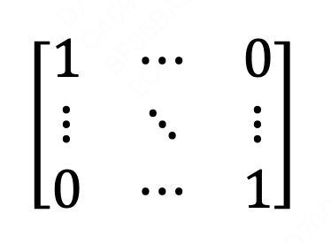

### 前言

  在计算机图形学中，矩阵是非常常见的基础知识，尤其是在3D图形计算中，其作用是极大的。它能极大的提高3D问题中复杂计算的效率。
  
  如果没有矩阵的话，每一种基本的操作（**平移、旋转、缩放、投影**）都会牵扯到巨大的数学计算。因为，任意的3D模型都是由最基本的三角形组成的，一个模型可能有成百上千个三角形组成，平移一个最简单的模型，实际上移动的是这成百上千个三角形，也就是说，每个三角形都需要进行一遍相同的数学加减乘除操作，这个计算量可想而知。
  
  然而，如果把这些数学计算用矩阵代替的话，计算量就会骤减，简单的用一个矩阵乘法，结果就出来了！

### 什么是矩阵

> "矩"，顾名思义就是矩形啦，由数字组成的矩形。"阵"，就是这些数字是整整齐齐的。在矩阵中，横向数字是行，竖向数字是列，行和列都是整数，可以是1或者n（n为整数）。在矩阵中，我们通常会说第几行、第几列来确定某个数字的具体位置。

### 矩阵的由来

矩阵，说到底其实是一个数学问题，很多人一看到数学符号就很头疼。
在我们小学的时候，我们老师可能会问过这个问题，一个成年人一小时可以走3公里，那么他走了9公里，用了多少小时。这个很简单就得到是3小时。

好了，我们再看一个复杂的问题，《鸡兔同笼》，一个笼子里关着鸡和兔，从上面数，一共有18个头，从下面数，一共有48只脚。问笼子里各有多少只鸡和兔？

如果我们用小学的方法去做，是有点绕的，因为这个题目中含有俩个未知数。这时候老师会告诉我们用设未知数的方法去求解会简单的多。我们设鸡的数量为(x)，兔的数量为(y)，就可以得到下面的方程：
$x+y=18$  
$2x+4y=48$

这时，这个问题就很好解决了。一般人到这里可能就停止思考了，但是有一些数学家看到这个二元一次方程又想，有没有什么办法，把它弄的和上面的一元一次方程一样，解起来很方便呢？**这就是矩阵的雏形**。

数学家发现，所谓二元一次方程$2x+4y=48$，其实包含三个部分：  
**1. 代数x、y左边的系数**  
**2. 代数x、y本身**  
**3. 等号右边的数字**

而，一元一次方程$3x=9$也是3个部分：  
**1. x左边的系数**  
**2. x本身**  
**3. 等号右边的数字**

这个时候，我们类比一元一次方程的三个部分，将二元一次方程的三个部分提取出来，按照他们原来的排列组合列成了数字组合。  
第一部分是代数左边的系数，如下：
| 1 | 1 |
|---|---|
| 2 | 4 |

第二部分是代数本身，如下：
| x |
|---|
| y |

第三部分是表达式的结果，如下：
| 18 |
|----|
| 48 |

我们可以依照一元一次方程的样子，将这三个部分组合起来：

### 研究矩阵的乘法
那么具体是怎么计算的呢？我们先来研究一下矩阵的乘法计算的过程，我们先观察一下上面写出来的矩阵和原本方程有什么相似的地方。

上图中第一部分是原本的方程，第二部分是被创造出的矩阵，我们把矩阵做一个小小的变化，把二元一次方程的等待带入矩阵等式的右边，得到：

我们会发现，右边等式第一行是左边第一项第一行和第二项第一列的数字分别相乘再相加，右边第二行是左边第一项第二行和第二项第一列的数字相乘再相加。

我们总结出下面这条规律：

> 第一个矩阵的列数必须和第二个矩阵的行数相等，才能相乘

> 矩阵相乘不满足交换律

### 单位矩阵

单位矩阵需要满足下面两个条件：
- 是正方形矩阵
- 除了对角线上的数字是1以外，剩下的数字全是0。如下图，单位矩阵一般用大写的粗体**I**来表示。

说到这里，大家会觉得这不就是方便解方程什么的么，也不算什么啊。矩阵之所以**强大**，主要还是因为矩阵的实际应用。其实，矩阵在计算机图形学，尤其是3D图形计算中的作用是极大的。

在80年代初，在当时计算机的CPU还是8位的，计算机内存才1~2M，在这种情况下，3D游戏已经开始蓬勃发展了，原因就是使用了矩阵来进行了3D图形运算。

### 虚拟3D中的数学计算

#### 旋转

#### 平移

#### 缩放

#### 投影

### 总结