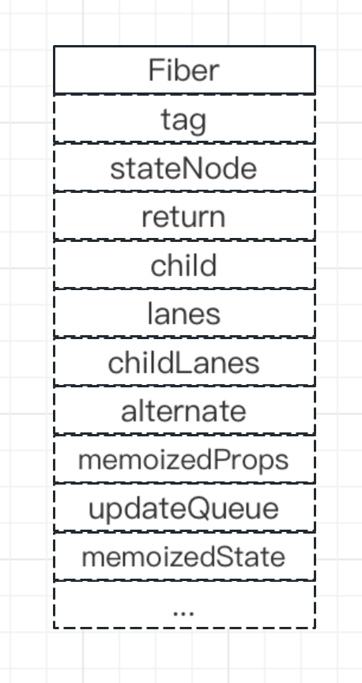
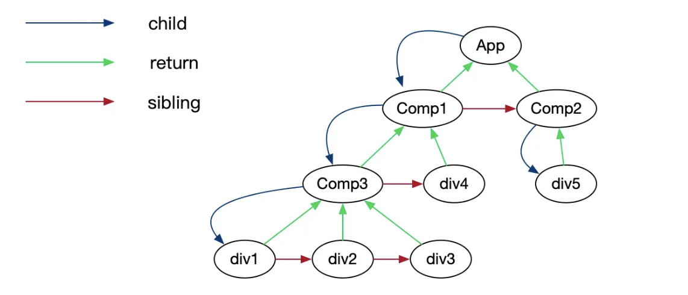
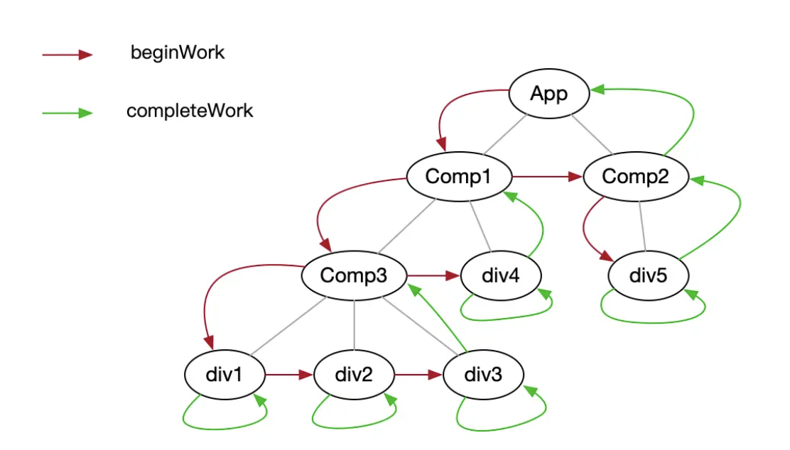

## Fiber

React 的 JSX 最终会被编译为`React.createElement()`，这个函数执行结果是返回了一个`ReactElement()`，而每一个 elemnt 对应了一个 fiber 对象



```js
{
    type:  // React.createElement 对应的type，表明这个fiber 节点对应的element
    tag:  // 表明fiber 的类型
    pendingProps:  // 已经是被更新的props，需要被运用到子组件或者dom 元素上
    key: // 对应prop 上的key
    stateNode:  // dom节点(HostComponent) / 类组件的实例 (ClassComponent) / fn() (FunctionComponent)
    nextEffect:  // 指向下一个**effect list**中的节点 （effect list：一个workInProgress（finishedWork）的子树，是在render阶段 最终需要决定被执行更新 的产物，会在commit阶段被处理）
    effectTag:  // 当前fiber需要执行的副作用类型
    alternate:  // 用于构成**workInProgress**（从当前fiber树构建而来，反应了需要被更新渲染到用户屏幕的状态树）
    return: // 指向父fiber节点
    sibling: // 指向兄弟fiber节点
    child： // 指向child fiber节点
  }
```

同时这里还会注册事件。我们知道在 React 中，使用了事件代理自己实现了一套事件系统，在 React17 之前都是绑定到 document 上，而在 17 之后绑定到根元素节点即 div#root。因此我们在写代码时，虽然在 React 组件上绑定了像 onClick、onFocus 等事件，最终都是通过代理的方式触发的。

我们在入口文件里会写上这么一句代码，其实执行的是内部的 render 方法：

```js
ReactDOM.render(<App />, document.getElementById("root"));

// 在/packages/react-dom/src/client/index.js --> /packages/react-dom/src/client/ReactDOM.js --> src/react/packages/react-dom/src/client/ReactDOMLegacy.js
export function render(
  element: React$Element<any>,
  container: Container,
  callback: ?Function
) {
  // 判断容器是否合法，<div id='root'></div>,
  invariant(
    isValidContainer(container),
    "Target container is not a DOM element."
  ); // 省略非重要代码...
  return legacyRenderSubtreeIntoContainer(
    null,
    element,
    container,
    false,
    callback
  );
}
```

React 采用了“双缓存”的思想，此时有两棵 Fiber 树，一个是 current，对应浏览器当前已经渲染的 dom 树，一个是 workInProgress，是在初始化时或者组件状态更新后由 reconciler 创建的一个工作副本。

React 的渲染流程分为俩个阶段，一个是 render，一个是 commit

## Render 阶段

render 阶段开始于 performSyncWorkOnRoot 或 performConcurrentWorkOnRoot 方法的调用，这两个方法的差异在于一个是同步，而另一个是异步(concurrent)的。

这两个方法分别会调用下面两个方法—— workLoopSync 和 workLoopConcurrent：

```js
function workLoopSync() {
  // Already timed out, so perform work without checking if we need to yield.
  while (workInProgress !== null) {
    performUnitOfWork(workInProgress);
  }
}

function workLoopConcurrent() {
  // Perform work until Scheduler asks us to yield
  while (workInProgress !== null && !shouldYield()) {
    performUnitOfWork(workInProgress);
  }
}
```

在初始化的过程中，React 是采用同步的方式，不管是同步还是异步，他们都调用了 performUnitOfWork 方法：

```js
function performUnitOfWork(unitOfWork: Fiber): void {
  const current = unitOfWork.alternate; // current树上对应的Fiber节点，有可能为null
  // ...省略

  let next; // 用来存放beginWork()返回的结果
  if (enableProfilerTimer && (unitOfWork.mode & ProfileMode) !== NoMode) {
    // ...省略
    next = beginWork(current, unitOfWork, subtreeRenderLanes);
    // ...省略
  } else {
    next = beginWork(current, unitOfWork, subtreeRenderLanes);
  }

  // ...省略
  unitOfWork.memoizedProps = unitOfWork.pendingProps;
  if (next === null) {
    // beginWork返回null，表示无（或无需关注）当前节点的子Fiber节点
    completeUnitOfWork(unitOfWork);
  } else {
    workInProgress = next; // 下次的workLoopSync/workLoopConcurrent的while循环的循环主体为子Fiber节点
  }

  // ...省略
}
```

在没遍历执行 beginWork 之前，react 也不知道后续的组件结构会是啥样，所以在 beginWork 时每遇到一个组件时都要记录下来，同时要记录父组件和子组件、组件与组件间的关系，这样才能保证后续创建出来的 dom 树不会错乱掉。react 内部对于每个组件都会创建成 Fiber 对象，通过 Fiber 记录组件间的关系，最后构成一个 Fiber 链表结构。 父组件 parentFiber.child 指向第一个子组件对应的 fiber，子组件的 fiber.return 指向父组件，同时子组件的 fiber.sibling 指向其右边的相邻兄弟节点的 fiber, 构成一个 fiber 树。



beginWork 的遍历并不是先查找完某一层所有的子元素再进行下一层的查找，而是只查父元素的第一个子元素，然后继续查找下一层的子元素，如果没有子元素才会查找兄弟元素，兄弟元素查找完再查找父元素的兄弟元素，类似于二叉树的前序遍历。所以对于上图的结构，遍历顺序如下:
App->Comp1->Comp3->div1->div2->div3->div4->Comp2->div5

### beginWork 阶段

beginWork 主要的功能就是遍历查找子组件，建立关系树。

- 对于函数式组件，会执行组件对应的函数，注册 hooks，同时拿到函数 return 的结果，即为该组件的 child

- 对于 class 组件，会先实例化 class，在这个阶段也会调用 class 的静态方法 getDerivedStateFromProps 以及实例的 componentWillMount 方法最后执行 render 方法拿到对应的 child

在 mount 阶段和 update 阶段， beginWork 的执行逻辑也有区别的。 我们都知道为了减少重排和重绘，react 帮助我们找出那些有变化的节点，只做这些节点的更新。

- 在 mount 阶段，因为在这之前没有创建节点，所以每个节点的 fiber 都是新建的

- 在 update 阶段，会通过 diff 算法判断当前节点是否需要变更，如果需要变更会重新创建新的 fiber 对象并复用部分老的 fiber 对象属性，如果不需要变更则直接 clone 老的 fiber 对象；如果 diff 对比后老的 fiber 存在，新的 fiber 不存在，则会给 fiber 打上 Deletion 标签标示该元素需要删除； 如果老的 fiber 不存在，新的 fiber 存在说明是新创建的元素，则给 fiber 打上 Placement 标签

### completeWork 阶段

completeWork 阶段主要执行 dom 节点的创建或者标记变更。

- 在 mount 阶段时，对于自定义组件比如 class 组件、函数式组件，其实不做什么特殊处理; 对于 div、p、span(这种组件在 react 内部定义为 HostComponent)，就会调用 document.createElement 方法创建 dom 元素存放到该节点 fiber 对象的 stateNode 字段上；对于父元素是 HostComponent 的情况，先创建父元素的 dom 节点 parentInstance， 然后调用 parentInstance.appendChild(child)方法将子元素挂在该节点上。

- 在 update 阶段，如果老的 fiber 存在则不会重新创建 dom 元素，而是给该元素打上 Update 标签；如果是新的元素和 mount 阶段一样创建新的 dom 元素

**此时，beginWork 和 completeWork 是交替执行。**



经过 beginWork、completeWork， 每个组件节点的 dom 元素都创建完成或是被打上了对应的标签。在 mount 阶段，根组件下已经挂载了所有子元素节点的 dom， 那么只需要将根组件 dom 节点插入到 div#app 下即可；update 阶段组件 fiber 都被打上了标记，哪个元素需要删除，哪个需要更新都在下个阶段这些；这些操作在 commit 流程中进行。

至此 fiber 结构应该长这样:


## Commit 阶段

上面说了对于 dom 元素挂在到根标签 div#root 上以及一些元素的删除、更新等都是在 commit 阶段进行。 此外我们声明的一些 useLayoutEffect、useEffect 等 hooks，以及组件的生命周期也会在该阶段运行。 commit 又分为 3 个阶段分别为 commitBeforeMutationEffects、commitMutationEffects、commitLayoutEffects

### commitBeforeMutationEffects

对于 HostRoot 根组件，在 mount 时会清除根节点 div#root 已有的子元素，为了插入 App 的 dom 做准备。

- 对于函数式组件，在这个阶段会通过 react-scheduler 以普通优先级调用 useEffect 但是不会立刻执行，可简单认为在这里加了一个延时器执行 useEffect;

- 对于 class 组件会调用静态方法 getSnapshotBeforeUpdate, 即组件被提交到 dom 之前的方法

### commitMutationEffects

在这个阶段，主要是根据组件上打的对应标签，执行不同的逻辑

- 在 mount 阶段，App 组件对应的 dom 节点就会挂在到 div#root 上了，此时页面就可以看到对应的元素了；

- 在 update 时，会根据被打的标签执行对应的 Update、Deletion、Placement 等；

同时在该阶段，如果存在 useLayoutEffect 的回调即组件被销毁的函数也会在该阶段执行

### commitLayoutEffects

因为上个阶段已经把组件的 dom 元素挂在到页面中去了，这个阶段主要是执行组件的 mount 生命周期函数，比如函数组件的 useLayoutEffect、componentDidMount；以上三个阶段执行完，如果没有更高优先级的任务(比如在 didMount 生命周期里有调用 setState)，则第一阶段延迟执行的函数会调用 useEffect； 如果有则会进入 update 阶段，重新执行 beginWork、completeWork、commit。

其实可以发现 useEffect 和 componentDidMount 的执行时机还是有区别的。
