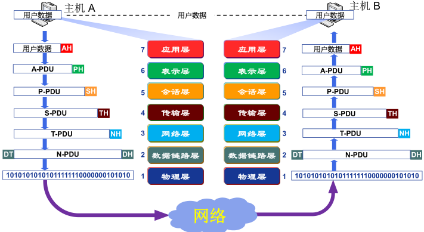

开放系统互联参考模型是由国际标准化组织（ISO）于 1984 年提出的分层网络体系结构模型，目的是支持**异构网络系统**的互联互通，是异构网络系统互联的**国际标准**，如图所示。我们这里讨论的传输层属于第四层。

### 一、传输层功能

给应用进程之间提供**端到端**的逻辑通信服务

1. 传输层寻址；

2. 对应用层报文进行分段和重组；

3. 对报文进行差错检测；

4. 实现进程间端到端可靠数据传输控制；

5. 面向应用层实现复用与分解；

6. 实现端到端的流量控制；

7. 拥塞控制；

### 二、传输层寻址与端口

一台计算机中，不同应用进程用**进程标识符（进程 ID**）来区分
在传输层使用协议端口号，通常简称为端口（port）
在全网范围内利用  **『IP 地址+端口号』**  唯一标识一个通信端点

传输层端口号为 16 位整数，可以编号 65536 个（2 的 16 次方）
常用端口：**端口号小于 256 的端口**

| 端口号      | 类别       |              |
| ----------- | ---------- | ------------ |
| 0-1023      | 熟知端口号 | 服务器端口号 |
| 1024-49151  | 登记端口号 | 服务器端口号 |
| 49152-65535 | 短暂端口号 | 客户端口号   |

### 三、无连接服务与面向连接服务

| 无连接服务（UDP）                                                              | 面向连接服务（TCP）                                                                            |
| ------------------------------------------------------------------------------ | ---------------------------------------------------------------------------------------------- |
| 提供无连接、不可靠的数据报传输服务                                             | 提供面向连接的、可靠的、有序的字节流传输服务                                                   |
| 数据传输之前：无需与对端进行任何信息交换，直接构造传输层报文段并向接收端发送。 | 数据传输之前：需要双方交换一些控制信息，建立逻辑连接，然后再传输数据，传输结束后还需要拆除连接 |
| 类似于信件通信                                                                 | 类似于电话通信                                                                                 |

### 四、传输层的复用与分解

多路复用与多路分解（复用与分解 / 复用与分用）：支持众多应用进程共用同一个传输层协议，并能够将接收到的数据准确交付给不同的应用进程。

1. 多路复用：在源主机，传输层协议从不同的套接字收集应用进程发送的数据块，并为每个数据块封装上首部信息（包括用于分解的信息）构成报文段，然后将报文段传递给网络层。

2. 多路分解：在目的主机，传输层协议读取报文段中的字段，标识出接收套接字，进而通过该套接字，将传输层的报文段中的数据交付给正确的套接字。

### 五、停-等协议与滑动窗口协议

#### 1、可靠数据传输基本原理

不可靠传输信道在数据传输中可能发生：

- 比特差错： 1001 变为 1000；

- 乱序： 数据块 1、2、5、6、3、4；

- 数据丢失： 数据块 1、2、5；

为了使传输层提供可靠的数据传输服务，基于不可靠信道实现可靠数据传输需要采取以下措施：

- 差错检测： 利用编码实现数据包传输过程中的比特差错检测；

- 确认： 接收方向发送方反馈接收状态；

  - NAK（ 否定确认），Negative Acknowledgement， 没有正确接收数据；

  - ACK（ 肯定确认），Positive Acknowledgement， 正确接收数据；

- 重传： 发送方重新发送接收方没有正确接收的数据；

- 序号： 确保数据按序提交；

- 计时器： 解决数据丢失问题；

#### 2、停等协议

1. 发送方发送经过差错编码和编号的报文段， 等待接收方的确认；

2. 接收方如果差错检测无误且序号正确， 则接收报文段， 并向发送方发送 ACK，发送方收到 ACK，继续发送后续报文段；

3. 接收方如果差错检测序号有误，则丢弃报文段， 并向发送方发送 NAK，发送方收到 NAK， 重发刚刚发送的报文段。

停-等协议的缺点：**性能差，信道利用率低**

#### 3、滑动窗口协议

**流水线协议（管道协议）**： 允许发送方在没有收到确认前连续发送多个分组。  
最典型的流水线协议：**滑动窗口协议**。

1. 增加分组序号。

2. 发送方和接收方可以缓存多个分组。

##### ① 回退 N 步协议（GBN 协议，Go-Back-N）

**GBN 协议的特点：**  
发送端缓存能力高，可以在没有得到确认前发送多个分组。  
接收端缓存能力很低，只能接收 1 个按序到达的分组，不能缓存未按序到达的分组。

**GBN 发送方响应的 3 类事件：**

1. 上层调用
2. 收到 1 个 ACKn。GBN 采用累积确认方式，即发送方收到 ACKn 时，表明接收方正确接收序号 n 以及序号小于 n 的所有分组。
3. 计时器超时。发送方只使用一个计时器。

###### ② 选择重传协议（SR 协议, Selective Repeat）

**SR 协议特点：**  
发送端缓存能力高。  
接收端缓存能力高，

**SR 发送方响应事件：**

1. 上层调用。
2. 计时器超时。发送方对每个分组进行计时。
3. 收到 ACKn。SR 协议采取逐个确认方式

### 六、用户数据报协议（UDP）

提供无连接、不可靠、数据报尽力传输服务。

#### 1、UDP 特点

1. 应用进程容易控制发送什么数据以及何时发送，会出现分组的丢失和重复。
2. 无需建立连接。
3. 无连接状态。
4. 首部开销小，只有 8 个字节（Byte）。

#### 2、UDP 数据报结构

#### 3、UDP 校验和

**提供差错检测功能**
UDP 的校验和用于检测 UDP 报文段从源到目的地传送过程中，其中的数据是否发生了改变。

**UDP 校验和计算规则**

1. 所有参与运算的内容按 16 位对其求和。

2. 求和过程中遇到溢出（即进位） 都被 回卷（即进位与和的最低位再相加）。

3. 最后得到的和取反码，就是 UDP 的校验和，填入 UDP 数据报的校验和字段。

### 七、传输控制协议（TCP）

提供面向连接、可靠、有序、字节流传输服务。

#### 1、TCP 报文段结构

#### 2、TCP 连接管理

以客户端上的一个应用进程与服务器上的一个应用进程建立一条 TCP 连接为例：

#### 3、TCP 流量控制

流量控制：协调发送方与接收方的数据发送与接收速度。  
在通信过程中，接收方设置报文段的接收窗口字段来将窗口大小通知给发送方

#### 4、TCP 拥塞控制

**① 拥塞**

太多的主机以太快的速度向网络中发送太多的数据，超出了网络处理能力，导致大量数据分组拥挤在中间设备队列中等待转发，网络性能显著下降的现象。

**② 拥塞控制**

通过合理调度、规范、调整向网络中发送数据的主机数量、发送速率、数据量，以避免拥塞或消除已发生的拥塞。

1. 拥塞预防策：预防拥塞发送。
   流量整形技术，规范主机向网络发送数据的流量。

2. 拥塞消除策略：基于拥塞检测机制，调整主机向网络中发送数据的速率和数量，从而逐渐消除拥塞。

③**TCP 拥塞控制算法**

1. 慢启动算法

2. 拥塞避免算法

3. 快速重传-计时器超时触发

4. 快速恢复-三次重复确认触发

5. 窗口调整的基本策略（Additive Increase, Multiplocative Decrease, AIMD）
